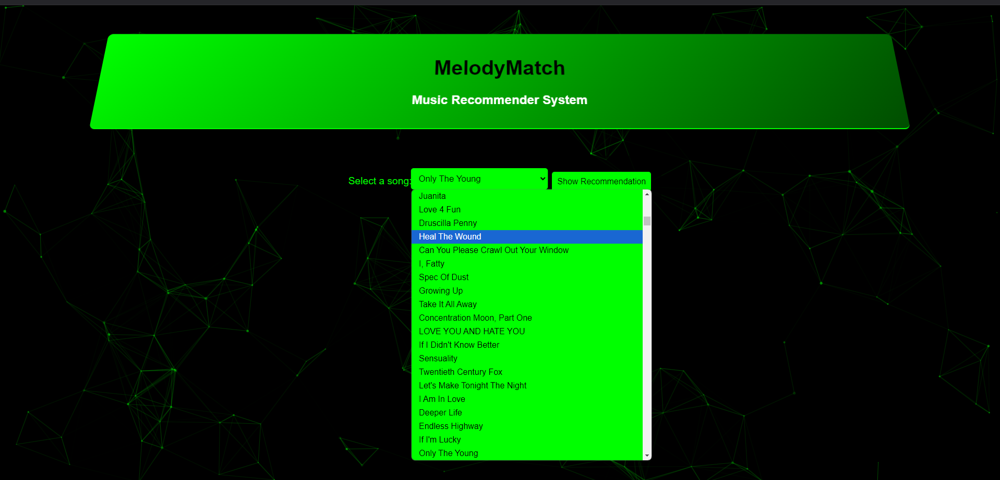

# 🎶 **MelodyMatch: Music Recommender System** 🎶

Welcome to **MelodyMatch**! 🎧 This is a **Music Recommender System** designed to provide personalized music suggestions based on your song preferences. Whether you're in the mood for a fresh track or looking to discover something new, **MelodyMatch** has got you covered! 💫

---

## 🚀 **Features**

- 🎵 **Song Selection:** Choose a song from a curated list of popular tracks.
- 🤖 **Smart Recommendations:** Get personalized song recommendations based on the song you select.
- 🎨 **Dynamic UI:** Experience a visually engaging interface with floating particles and smooth animations.
- 🎤 **Album Covers:** See album covers along with song recommendations for a more immersive experience.
- 📱 **Responsive Design:** Works seamlessly across devices — from desktops to mobile phones!

---

## ⚙️ **How It Works**

1. **Song Selection:**
   - Select a song from a dropdown menu of available tracks.
   
2. **Get Recommendations:**
   - Click the **"Show Recommendation"** button, and the system will fetch similar songs using machine learning models.
   
3. **Song Recommendations:**
   - Receive a list of recommended songs along with their album covers. These suggestions are personalized based on the song you chose!

---

## 🧑‍💻 **Technologies Used**

- **Flask** (Backend) 🌐
- **Spotipy** (Spotify API integration) 🎵
- **Python** (for backend logic) 🐍
- **HTML5** (for structuring the webpage) 🧱
- **CSS3** (for styling the page) 🎨
- **JavaScript (ES6)** (for dynamic interactions) 📜
- **Particles.js** (for cool particle background effect) ✨

---

## 🎬 **Preview**

### **Music Selection UI:**

- You’ll find a dropdown menu with a list of available songs that you can choose from. 🎶

 📷

### **Song Recommendations:**

- Once you choose a song and hit **"Show Recommendation"**, you'll see a list of recommended songs displayed along with their album covers. 🎤

 📷

---

## 🌍 **Live Demo**

You can try out the live demo of **MelodyMatch** by visiting our website:  
👉 [MelodyMatch Demo](https://melodymatch.onrender.com/)

---

## 🛠️ **Installation & Setup**

### **Prerequisites:**
- Python 3.8+ 🐍
- Flask 🎒
- Spotipy 🎧
- dotenv for environment variables 🌱

### **Steps to Run Locally:**

1. **Clone the Repository:**

   ```bash
   git clone https://github.com/yourusername/melodymatch.git
   cd melodymatch
